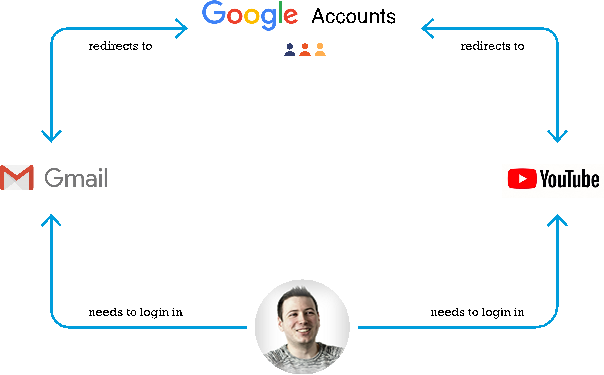
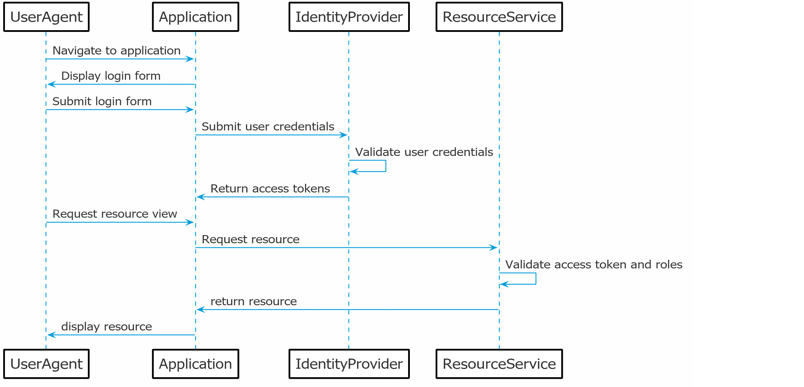
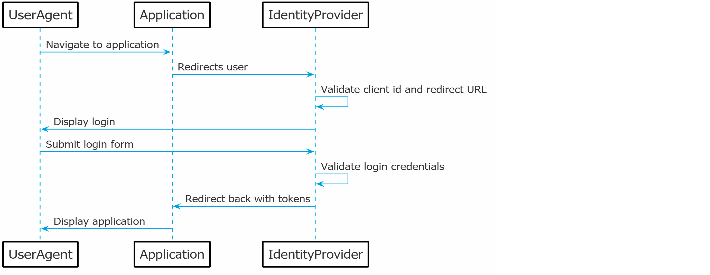

The term Single Sign-On has multiple meanings in the industry. A well-known one is to describe users signing into a platform once and gaining access to multiple applications. However, an SSO solution can provide a lot more than just simplified authentication. It can provide:

- Authorization based on roles to restrict or allow access to certain resources.
- Centralized user management, making it easier to audit and be compliant with certain certifications.
- Supporting multiple authentication protocols to connect to other identity providers.
- Connect legacy systems to integrate with existing user bases.

In addition, these solutions provide the benefit of having the authentication mechanism centralized and based on standards. This means not having to deal with authentication, or storing of user data in applications that need some form of login functionality.

In this first part of the SSO blog series, we will answer the following questions: 'What does an SSO solution provide other than simplify logins for your users?', 'What protocols are relevant in today's SSO solutions?' and 'What authentication flows are available and what makes them secure?'

## SSO Flow

Before we go into the details of what SSO solutions provide, the image below will be explained to give a better understanding of the standard Single Sign-On use case.

As a user you want to be able to access the web application provided by Google called Gmail. In SSO terms, an application that needs authentication is called a resource service. To gain access to the application, the user will need to authenticate itself with Google.

Google is the Identity provider which holds the credentials of the user account and can validate the user's provided credentials. Once successfully authenticated, the user gains access to the Gmail application.

Afterwards, the user wants to watch a video on YouTube. As YouTube is also an application of Google, the same identity provider is responsible for authenticating the user. As the user already successfully authenticated with Google, the user will be automatically logged into YouTube as well.

## Protocols

Authentication is one of the main functionalities of an SSO solution. This is not only relevant to the end-users but is also needed to communicate with different identity providers. Enabling communication with different identity providers provides users with the ability to log in with an existing account. This is a very common functionality for most websites nowadays where users can log in with their Google or Facebook accounts. However, in enterprise environments there are usually existing user bases in the form of an active directory. With the three authentication protocols listed below, most existing identity providers can be connected to an SSO solution.

### SAML 2.0

The SAML 2.0 protocol has been around since 2005 but is still very relevant these days as a lot of (older) identity providers authenticate their users with this protocol. It is therefore important that your SSO solution supports this protocol when you want to connect to legacy systems.

The protocol provides a framework for setting up session data when the user provides its credentials. The credentials however are never shared with the application initiating the authentication. Once the application demands authentication, the user is redirected to the identity provider and will have to provide its credentials to the identity provider. The user will be redirected back to the application and the application will receive proof of authentication.

The user only providing their credentials to the identity provider makes this authentication flow much more secure, especially if you are dealing with third-party applications that use your SSO solution. The main drawback of the SAML protocol is that it creates a stateful authentication, where stateless architectures are more preferred due to scalability.

### OAuth2

The OAuth protocol is in many aspects the same as SAML. It provides a framework for setting up session data and also redirects the user to provide credentials directly to the identity provider instead of the application requesting authentication. The difference is that it creates a stateless authentication for the user in the form of access tokens. Such a token is proof that the user has successfully authenticated and can be validated through the issuer of the token. Access tokens can either be a random value, in which case the token has to be sent back to the issuer to validate it, or it can be a JSON web token in which case the token can be validated with the public key of the issuer.

Being able to validate the token without the need to invoke the identity provider is why this method is stateless and also much more scalable. Furthermore, OAuth is also one of the most popular protocols to authenticate users. Services like Facebook, Google and Twitter, but also a lot of other services all use this protocol and it is, therefore, a must to have your SSO solution support this protocol.

### OpenID Connect

One of the things that the OAuth2 protocol misses is some form of standardization. OAuth2 is a specification and the implementation should be the same for all parties, but in practice, you see that there are differences when you set up authentication with Google or Twitter. The OpenID Connect protocol is a layer on top of OAuth2 that standardizes certain aspects like endpoints and token formats.

With this standardization, it becomes much easier to authenticate to an OpenID Connect supported identity provider. With standardization, there are also a lot more out-of-the-box solutions in the form of libraries and SDKs that make it even easier to enable authentication for your application. OpenID Connect support in your SSO solution will provide your partners, that want to connect to your platform, with a very easy way to integrate.

## Authentication Flows

Several flows make it possible to authenticate users or other systems to an application. As there are multiple flows available, and some already deprecated, we listed the most known flows and how they differ from each other.

### Authorization code flow

The most secure, but also most complicated flow is known as the authorization code flow. This flow starts with redirecting the user to the identity provider once the user clicks on the login link in an application. The identity provider will display a login form where the user can enter their credentials. Once the credentials have been validated by the identity provider, the user is redirected back to the application with a single authorization code.

With this authorization code, the application can retrieve an access token once from the identity provider. Once the access token has been retrieved, the authorization code is invalidated.

With the access token, the application can request resources from a resource service. The resource service can validate the token, based on the public key of the identity provider. In addition, the access token can also contain certain roles that the authenticated user has. The application can read these from the token and make certain authorization choices based on these roles.

### Client credential flow

If there is a need for server-to-server communication, the client credential flow can be used. The authorization code flow uses a redirection which is not feasible for a server to use, as such, the client credential flow uses a client ID and secret to retrieve an access token directly from the identity provider. There is also no authorization code involved as the client ID and secret should be kept private between the two parties and should only be communicated from a server to server environment.

### Direct access flow

The direct access flow is identical to the client credential flow but is meant for end users of the application. This flow doesn't redirect the user and also doesn't include the authorization code. This means that the username and password of the user are directly sent to the identity provider in exchange for an access token. The problem with this flow is that the username and password are provided to the application instead of the form of the identity provider. Therefore it is not a very secure flow and is not recommended when connecting third-party applications to the SSO solution.

### Implicit flow

The implicit flow is not a recommended flow. When this flow was created, browsers had limitations and several workarounds had to be used. The flow has many steps in common with the authorization code flow but misses some key aspects of making it secure. The main difference is that the access token is sent back to the application directly in the redirection step. When an access token is sent back in a redirection, there are multiple ways for attackers to intercept this token.

## Summary

In this first post we've gone over what we see as Single Sign-On and the different protocols that are relevant right now. We've also gone more in-depth on the flows of the OAuth2.0 and OIDC protocols. In the next post, we will look at four industry leaders in the SSO space and their product offerings. We will make a comparison of their features and will offer you criteria that are important to look at when making your decision for the best solution.
