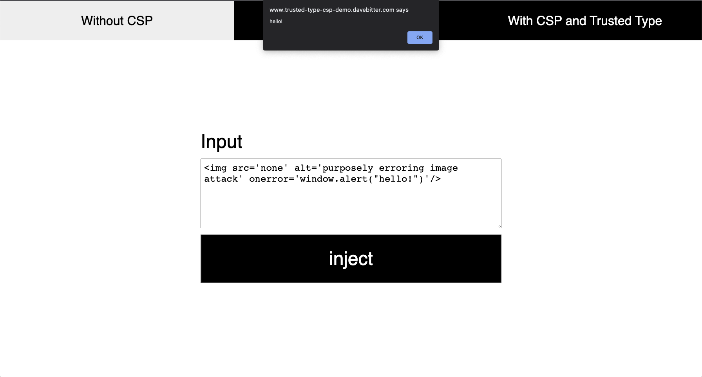
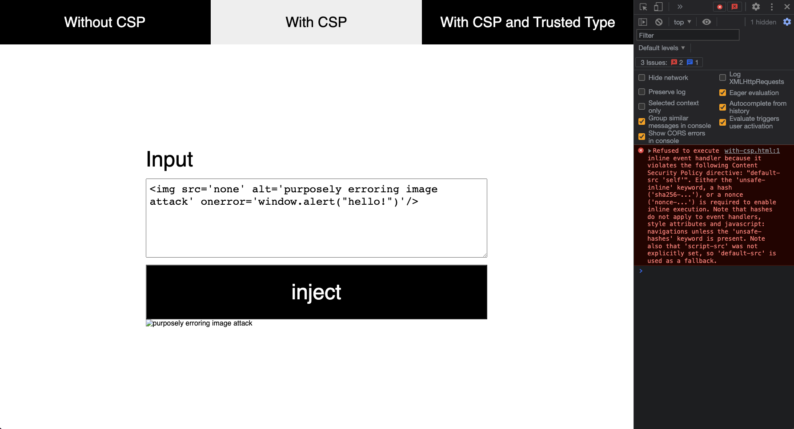
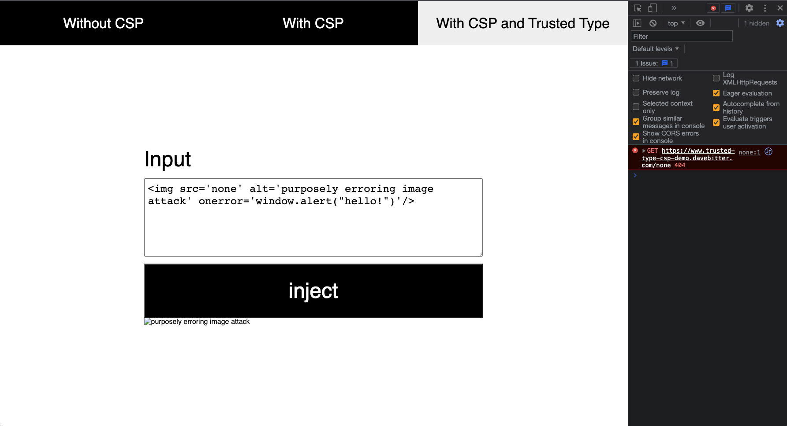
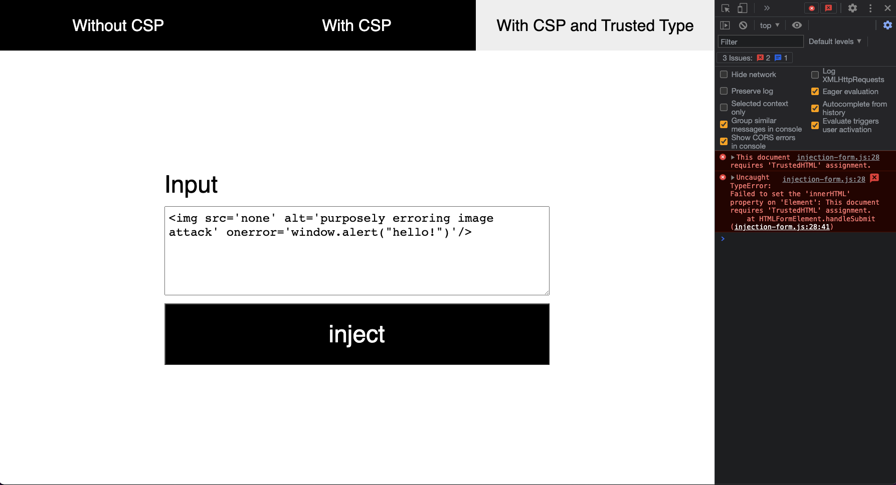

At iO, we continuously work on improving our skills. Recently quite a few developers, including myself, followed a two-day training course on web security by [Philippe De Ryck](https://pragmaticwebsecurity.com/about.html). This course covered a wide arrange of topics, but one technique, in particular, stood out to me. He showed how you can use Trusted Types in your Content Security Policy (CSP) to protect yourself against cross-site scripting (XSS) attacks. Let’s have a look at what Trusted Types are, why you want to use this technique and how you can use it.

## What is XSS?

Firstly, let’s have a quick look at what XSS is again and how you could easily become vulnerable to this attack. XSS is a vulnerability that allows an attacker to inject malicious code into your website. Let’s look at a basic example of how this works in, for instance, a Single Page Application (SPA) if you don’t protect yourself. Let’s say you are building a comment section for this website ([please do](https://github.com/iodigital-com/io-technology/issues/53)). This website is built using [React.js](reactjs.org) so we’ll use that for the code examples. You might have a component that displays some data that is fetched from an API:

```jsx {9}
import React from 'react'

const Comments = ({ comments }) => {
  return (
    <ul>
      {comments.map(({ id, content, authorName }) => (
        <li key={id}>
          <strong>{authorName} wrote: </strong>
          <span dangerouslySetInnerHTML={{ __html: content }} />
        </li>
      ))}
    </ul>
  )
}

export default Comments
```

If you have worked with React.js before, you probably used `dangerouslySetInnerHTML` before. So why do developers use this and why is it dangerous? `dangerouslySetInnerHTML` is used when you need to inject some HTML instead of a string. In this example, the comment was written in a what-you-see-is-what-you-get-editor (WYSIWYG). The editor then creates the HTML of the content and sends that over during the submission of the comment. This HTML “string” is then stored in the database. You as a developer then fetch all the comments and want to render that bit of HTML in the DOM. You don’t want to render the HTML as a string, hence the quotation marks, but want to create the DOM elements out of it. For this `dangerouslySetInnerHTML` is used.

### What is so dangerous about setting `innerHTML`?

Well, not much, **if you know what is being set(!)**. Even then, you are putting a lot of faith in it not being malicious. If you inject HTML that a user has written through a WYSIWYG-editor, you can’t trust it. Ever!

For instance, a malicious user can add this comment on your article page:

```jsx
Hey,

Malicious comment here:


```

Note that most attackers won’t be so nice to let you know the content is malicious. Let’s dissect this attack. The attacker adds an image element that has a `src` of “none”. This `src` will not resolve. Because of that, an error will be thrown. The attacker therefore adds an `onerror` attribute where they can execute JavaScript. In this case, there will be a harmless alert shown, but you can imagine that they can now load whatever JavaScript they want.

## How can I protect myself against this attack?

You can protect yourself from this attack by firstly never trusting any content that you receive to be directly injected into the DOM. You always want to make sure to handle this potentially malicious content accordingly.

By using `innerHTML`, you’re essentially telling the browser to inject en parse any HTML that you pass. Regardless of what it does. This way, the `onerror` will be added to the image element and you are vulnerable to the attack.

There are a couple of ways of doing this more safely.

### Using safe DOM APIs

You can make use safe DOM APIs to inject and parse the content. For instance, you could create a paragraph element where you set the `textContent`:

```jsx
const commentParagraph = document.createElement('p')

commentParagraph.textContent = comment.content

document.getElementById('comments').appendChild(commentParagraph)
```

By using the `textContent` API, you tell the browser that you have some text content that you want to show. If this content contains malicious code, this will just be added as text content, not as actual code in the DOM.

### Using sanitization on the output

Now, earlier I said that the comment contains HTML that the WYSIWYG editor generated. This HTML code is in fact what we want. It might contain some perfectly fine elements like `ol`, `ul`, `li`, `strong` and so on. So how can you keep the safe HTML, but strip out the parts like the `onerror` attribute on the image?

You can make use of a package like [DOMPurify](https://github.com/cure53/DOMPurify). This package sanitises the content it is passed with sensible defaults which you can always tweak if you know what you are doing. Let’s go back to the React.js Example and add DOMPurify:

```jsx {2,10}
import React from 'react'
import * as DOMPurify from 'dompurify'

const Comments = ({ comments }) => {
  return (
    <ul>
      {comments.map(({ id, content, authorName }) => (
        <li key={id}>
          <strong>{authorName} wrote: </strong>
          <span dangerouslySetInnerHTML={{ __html: DOMPurify.sanitize(content) }} />
        </li>
      ))}
    </ul>
  )
}

export default Comments
```

Now when the content is injected and parsed in the DOM, the `onerror` attribute will be stripped. Perfect, problem solved! Or not?

### Don’t trust yourself and your fellow developers

Yes, DOMPurify will sanitise the content and prevent an XSS attack from being executed. There is one big if, however. If you forget this sanitization once, you are vulnerable again. Now, you could add linting rules, code review processes and other attempts to prevent this, but inevitably someone will get passed this (e.g. turn off the linting rule) and you are vulnerable again. Aren’t there better ways?

## How can I use CSP to protect myself?

You can use CSP for quite a few things, but let’s focus on the example at hand. If malicious JavaScript being executed is the real issue, can’t you just block that? You can! I’ve built a demo website to showcase different solutions. Firstly, let’s see what happens when you don’t have any CSP on your page [showcased here](https://www.trusted-type-csp-demo.davebitter.com/).



Once you hit the injection button, the following code is executed and the XSS vulnerability is exploited:

```jsx
const elements = {
  injectionForm: document.querySelector('[data-injection-form]'),
  injectionFormInput: document.querySelector('[data-injection-form-input]'),
  injectionFormOutput: document.querySelector('[data-injection-form-output]'),
}

const handleSubmit = (e) => {
  e.preventDefault()

  const formData = new FormData(e.currentTarget)
  const input = formData.get('input')

  elements.injectionFormOutput.innerHTML = input
}

elements.injectionForm.addEventListener('submit', handleSubmit)
```

### Adding a basic CSP header

You can add a basic CSP header that looks like this:

```jsx
<meta http-equiv="Content-Security-Policy" content="default-src 'self'" />
```

Now when you hit the injection button the malicious JavaScript of the `onerror` attribute will not be executed as [showcased here](https://www.trusted-type-csp-demo.davebitter.com/with-csp.html):



You can see the error thrown by the CSP in the console. To clean this up a bit up you can use DOMPurify to remove the `onerror` attribute just like we did before so you will just see this message if you forgot to sanitise somewhere:



Perfect, all done! Right?

### Adding a Trusted Types CSP header

No, you could even take it a step further by adding [the Trusted Types CSP header](https://developer.mozilla.org/en-US/docs/Web/HTTP/Headers/Content-Security-Policy/require-trusted-types-for). Beware, this is an experimental feature that is driven by Google. The current support is:


First, you add the Trusted Types CSP header:

```jsx
<meta http-equiv="Content-Security-Policy" content="require-trusted-types-for 'script'" />
```

Now when you hit the injection button none of the content is injected and parsed in the DOM:



Next to that, it shows a more detailed error message for you as a developer as to where the `innerHTML` was used to try to inject and parse the content in the DOM.

Next, you can configure a Trusted Types Policy:

```jsx
if (window.trustedTypes && trustedTypes.createPolicy) {
  trustedTypes.createPolicy('default', {
    createHTML: (string) => string.replace(/\</g, '<').replace(/\>/g, '>'),
  })
}
```

Note that you have to feature detect whether Trusted Types a supported. This does seem like some manual work where you can easily make some mistakes as defending against XSS can get quite complex. Can’t you just use DOMPurify for this and ask it to both sanitise and give back a Trusted Type. That way you can rely on that package and get the sanitised content to inject and parse in the DOM.

Let’s revisit the earlier example using DOMPurify and ask for a Trusted Type as well:

```jsx {2,12}
import React from 'react'
import * as DOMPurify from 'dompurify'

const Comments = ({ comments }) => {
  return (
    <ul>
      {comments.map(({ id, content, authorName }) => (
        <li key={id}>
          <strong>{authorName} wrote: </strong>
          <span
            dangerouslySetInnerHTML={{
              __html: DOMPurify.sanitize(content, {
                RETURN_TRUSTED_TYPE: true,
              }),
            }}
          />
        </li>
      ))}
    </ul>
  )
}

export default Comments
```

Now when you hit the injection button the malicious JavaScript of the `onerror` attribute will not be executed and the safe content will be injected and parsed as [showcased here](https://www.trusted-type-csp-demo.davebitter.com/with-csp-and-trusted-type.html):


## Develop with the Trusted Types CSP header set

One of the great benefits I see is that this is a perfect tool during development as well. Make sure to set the CSP header for Trusted Types during development. This way, even if your content does not have potentially risky attributes like `onerror` which are being injected and parsed in the DOM, you will notice when you don’t use the correct sanitization with a Trusted Type. You will simply not see your content on the screen and get a helpful error message.

Even with our best intentions as developers, we all make mistakes. XSS being [one of the most common web vulnerabilities on the web](https://www.guru99.com/web-security-vulnerabilities.html) proves that we need to better defend ourselves and our users against this. I’m curious to see where Trusted Types are headed and hope I inspired you to try it out!

For a more in-depth view into Trusted Types, head over to [the article by Phillip De Ryck](https://auth0.com/blog/securing-spa-with-trusted-types/). To have a look at the demo code for this article, head over to [the repository on GitHub](https://github.com/DaveBitter/csp-trusted-type).

Thanks for reading and stay safe!
