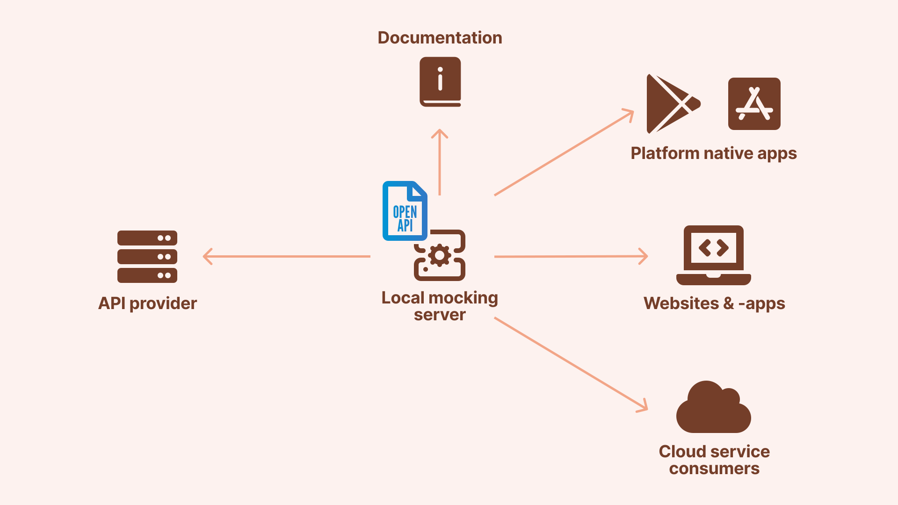
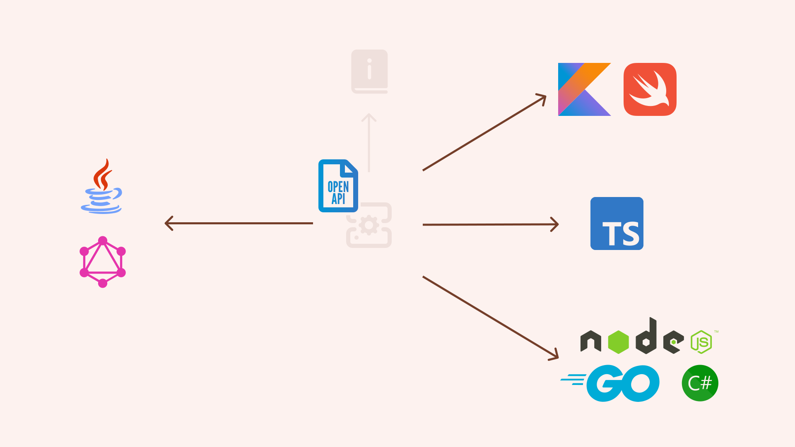

In the previous parts of this series, we introduced you to the OpenAPI specification, how to describe an API provider in an OpenAPI document, the approaches we can take incorporating it on workflows helping us build and integrate with RESTful APIs. In this part, we will discuss the tooling that is available to optimise our OpenAPI workflows.

 

## Documentation

The most popular type of tooling for the OpenAPI specification is documentation generation. It allows us to take the information of an OpenAPI document and present it in a tailored fashion. For example, non-technical users might not be familiar with reading JSON or YAML-based files. With documentation generation, we can give every stakeholder of our project insights into how the data from and to an API provider flows.

Some examples of OpenAPI documentation generators:

- [Swagger UI](https://github.com/swagger-api/swagger-ui): The most well-known one. The green documentation site. Maintained by Swagger, the original author of the OpenAPI specification, formerly known as the Swagger specification.
- [Stoplight Elements](https://github.com/stoplightio/elements): A fresh take on OpenAPI documentation, focusing more on the metadata, like titles and descriptions, rather than the technical information. It also includes a code snippet generator with snippets for dozens of programming languages and their flavours.
- [ReDoc](https://github.com/Redocly/redoc): A generator that creates full-screen OpenAPI documentation experiences. Code snippets and examples live next to the section of the operation described.

## Code generation

With the Code First workflow, the API provider will likely generate the OpenAPI document. For the Design First workflow, we can reverse this by generating our communication layer of providers and/or consumers.

With code generation, we don't have to write API clients anymore. The entire API description is translated into tailored SDKs for our API providers and consumers.

Paths, endpoints, parameters, request bodies, etc., are transformed into methods, functions, types, interfaces, etc., of our desired programming language.

### Cross-programming language end-to-end type safety

Because an OpenAPI document also describes the types and formats of our dataflow, we have the opportunity to translate this to types and interfaces for typed programming languages. The OpenAPI specification is, therefore, a way to create **full cross-programming language end-to-end type safety** between API providers and consumers, just like GraphQL and tRPC give us.

The OpenAPI code generator community is very diverse, and there is no clear one solution to rule them all. However, https://openapi-generator.tech/ comes pretty close. This flavour of code generator is a Java-based templating engine that supports [all kinds of different API client configurations](https://openapi-generator.tech/docs/generators), even from other programming languages, ranging from TypeScript to PHP and everything in between. It even allows you to generate a whole GraphQL server that resolves to the described API operations.

There are also generators built on different programming languages. For example, I like [openapi-typescript-codegen](https://github.com/ferdikoomen/openapi-typescript-codegen/), which is built into TypeScript itself. I can include it as a build tool in front-end projects or repositories and have API client code generation as part of the build process.

On [OpenAPI.Tools](https://openapi.tools/#sdk), you can discover all sorts of OpenAPI tools and generators to add to and hone in your OpenAPI workflow.

## Mocking

When developing clients that are dependent on RESTful APIs, you may face a great deal of challenges communicating with the API provider.

- The provider and consumer are developed in parallel.
- I need a reliable, easy to influence API for integration testing.
- Connections to the data provider are not optimised, possibly slowing development efficiency.

In these cases, we want to recreate a separate local API provider we can develop against, a mocking server. For this, we could build one with the information coming from the OpenAPI description. But we don't need to.

Because Stoplight provides us with a mocking server tool, [Prism](https://github.com/stoplightio/prism). Prism takes an OpenAPI document and creates a fully-fledged local server that listens to requests on described paths and methods, validates the data for the types and formats you send to it and will respond with the correct types and formats. The values of the data respect the types described but will be of a random value.

[Stoplight Prism](https://github.com/stoplightio/prism) is a Node-based command line tool that you can run via NPM or Docker. It's as easy as running the command with the configuration that ingests the desired OpenAPI document, and within seconds it will start a server to which we can make requests.

This mocking automation allows teams building API consumers to develop against non-existing API dependencies or to build in parallel with planned API dependencies. It dramatically increases the independence within an API provider/consumer relation.

## Static Code Analysis

With the Design First approach, each stakeholder can work or propose alterations to the data flow by editing the OpenAPI document. We could have specific API patterns or best practices in place to ensure a certain degree of quality for our API.

Analogue to how we would lint our JavaScript code with ESLint, we can analyse our OpenAPI document with [Stoplight Spectral](https://github.com/stoplightio/spectral). This linter validates your OpenAPI document against specific rules. For example, are all paths kebab-cased? Do the examples adhere to the described schema?

## Automation

As with every software project, automation can benefit our workflow.

We already mentioned putting an OpenAPI document in a Git repository to enable **versioning** of our API description. By utilising [Git submodules](https://git-scm.com/book/en/v2/Git-Tools-Submodules) and adding our OpenAPI document repository to our provider's and consumer's repositories as a submodule, we can have a form of language-agnostic dependency management via Git. Each commit of the provider or consumer repository is tied precisely to a specific commit of the OpenAPI repository. Pull or Merge Requests are linted by CI/CD to check for code quality before merging it into our Single Source of Truth.

We can automate the generation of API client code at each start of the development environment so that our team is always using the latest version of the described API. Our IDEs immediately notice breaking changes, compilations steps, or CI/CD builds.

Our development environments include a step that will automatically run a local mocking server, or a shared mocking server is automatically deployed when the main version of the OpenAPI document has changed.

## Conclusion

Treating an OpenAPI document as a Single Source of Truth, utilising the right tools and providing automation with those tools gives our teams superpowers. We will spend less time trying to integrate and more time on the things that matter, like User Experiences, for example.

By using OpenAPI, we create full cross-programming language end-to-end type safety between API providers and consumers.

In next part of this series, we will take a look of a real-world example of how we can use OpenAPI in a front-end project.
