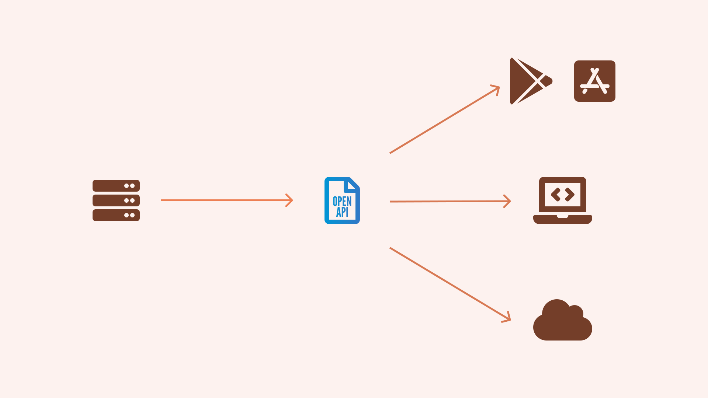

In the [previous part of this series](let-us-introduce-you-to-openapi), we explored the OpenAPI specification and how it can be used to document RESTful API providers and consumers. In this chapter, we'll explore the two main approaches that we can incorporate in to our daily workflows to optimize our API provider's and consumer's development process.

## Code First

The Code First workflow is where the API provider is the Source Of Truth of your API definition. In cases where an API provider is built using a well-maintained framework, chances are that there is a plugin available to automatically generate an OpenAPI document from the API endpoints and data models.

This workflow is useful when you have an existing RESTful API provider with plans to document it.

## Design First

With the Design First approach, we start with the OpenAPI document. The OpenAPI document is the **Single Source of Truth** for your API definitions.

This workflow allows for more collaboration between teams within a project. The document will be the neutral common ground for teams to discuss data flows and formats.

By placing a Design First OpenAPI document in a Git repository, teams can collaborate using the power over version control and propose changes via Pull or Merge requests.

It is great for new projects that need to build RESTful API providers and/or API consumers.

## Conclusion

Although not the most exciting part of building a RESTful API provider or consumer, governance of at least one the OpenAPI approaches above are essential to the success of your project.
