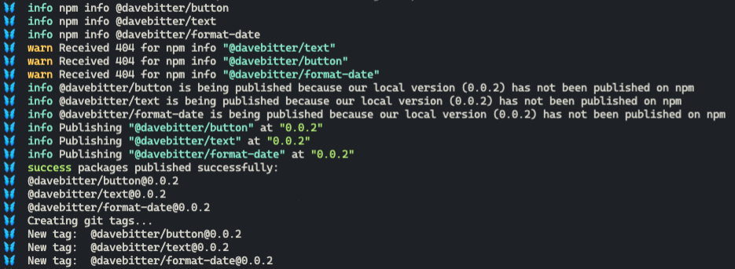
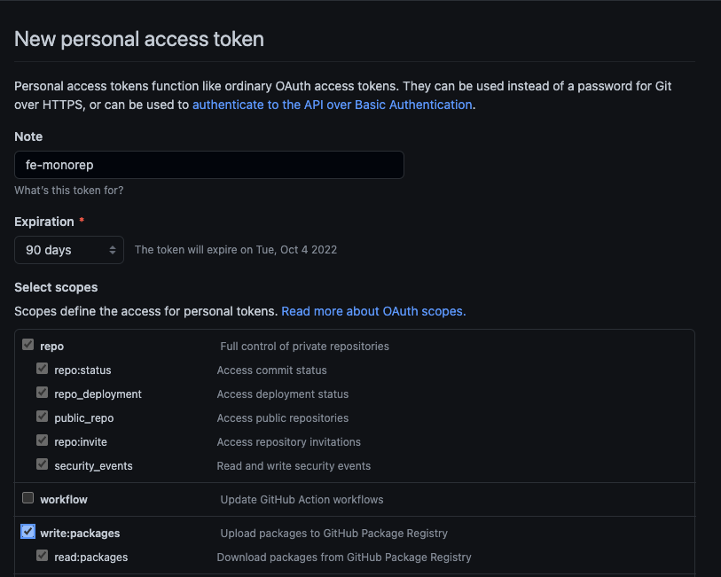

<div className="p-4 bg-io_blue-100">_This article is part 1 of the series [How do I build a Component Library?](/series/how-do-i-build-a-component-library). You can find the demo repository for this series on [GitHub](https://github.com/DaveBitter/fe-monorepo) and the component library itself hosted [here](https://fe-monorepo.davebitter.com/)._</div>

---

When building a component library, it is wise to have a solid setup to be able to offer your components to your consumers. Now, this naturally is heavily opinionated. Let’s have a look at how you might do it.

## How do I set up a monorepo with Yarn Workspaces?

My favourite way to separate the code for each component is using a monorepo. This way, you can create separate standalone packages for each of your components. These packages can then be used between one another and it keeps the code nicely scoped.

There are a variety of packages that can help you with this. I used to use [Lerna](https://github.com/lerna/lerna) a lot, but its future became uncertain a while back. [This issue](https://github.com/lerna/lerna/issues/2703) is an interesting read on that. It has since been taken over by [Nrwl](https://github.com/lerna/lerna/issues/3121), but I have made the shift to [Yarn Workspaces](https://classic.yarnpkg.com/lang/en/docs/workspaces/).

Yarn Workspaces allow you to set up multiple packages in such a way that you only need to run `yarn install` once to install all of them in a single pass. So, each package has its own `package.json` and `node_modules`. Yarn Workspaces will then make sure to install the dependencies in each package in your workspace, but also hoist duplicate packages up.

### Adding it to your repository

To turn your repository into a monorepo with Yarn Workspaces, you first have to update the `package.json` file in the root of your repository. First, add `"private": true`. This is a requirement from Yarn. Workspaces are not meant to be published, so they’ve added this safety measure to make sure that nothing can accidentally expose them.

Next, you need to tell Yarn where your packages will live. For now, let’s set it up so we can have component and utility packages. Add the following to the root `package.json`:

```json
"workspaces": [
    "packages/components/*",
    "packages/utilities/*"
  ],
```

This will tell Yarn that we have our packages in these two folders. Next, let’s add some placeholder packages. Your project structure might look something like this:

```
packages/
├── components/
│   ├── button/
│   │   ├── src/
│   │   │   └── index.ts
│   │   └── package.json
│   └── text/
│       ├── src/
│       │   └── index.ts
│       └── package.json
└── utilities/
    └── format-date/
        ├── src/
        │   └── index.ts
        └── package.json
package.json
```

Each package has its own `package.json` file where it can install its needed dependencies, run custom scripts and more. We’ve also added a temporary source folder with an empty `index.ts` file.

That’s it! From now on, you can run `yarn install` at the root of the project and Yarn Workspaces will take care of all your dependencies.

As an extra tip, you might want to take care of keeping all the dependencies in sync. In its essence, [Manypkg](https://github.com/Thinkmill/manypkg) is a linter for `package.json` files in Yarn, Bolt or pnpm mono-repos. You can use it to automate these chores. Simply run `yarn add @manypkg/cli` and you can run commands to help you with keeping your dependencies in sync. Read more about Manypk in my article _[Keeping dependencies in sync in your mono-repo](https://www.davebitter.com/quick-bits/manypkg)._

## How do I set up a SemVer strategy?

As we have all these separate packages that can install each other or be installed in another project, we want to make sure that we version each package correctly. We do this using [SemVer](https://semver.org/). In essence, whenever we make an update to a component, we want to make sure to update the version number in the corresponding package.json with either a patch, minor or major bump.

This process can be painstaking if you have a large number of package updates. You’d have to:

- keep track of which packages changed
- manually bump the version in the package.json correctly
- write a [changelog](https://www.freecodecamp.org/news/a-beginners-guide-to-git-what-is-a-changelog-and-how-to-generate-it/) file
- publish the package to a registry

How can we automate parts of this?

### Changesets

We can make use of [changeset](https://github.com/changesets/changesets) to help us. It provides a CLI tool and a few scripts to do the above. Firstly, add changesets with the following command in the root or the repository:

```markdown
yarn add @changesets/cli
```

Next, run the init command:

```markdown
yarn changeset init
```

This creates a `.changeset` folder in the root of your project that looks a bit like this:

```markdown
.changeset/
├── config.json
└── README.md
```

Let’s jump into the `config.json` file. Generally, you can leave it as is. One thing you might want to update is the `baseBranch` value. By default, this is set to “main”. Please update this to whatever your main branch is.

Great, we can now run a few commands.

#### Generate a changeset

`yarn changeset` will open up an interactive CLI tool that assists you in creating a changeset file that can be consumed. First, you select which packages you want to create a changeset for:


Next, you have to select the correct SemVer bump:


After that, you can add a summary of the change that will be used in the changelog. Note that it prompts you for a large summary as well if you are doing a major bump:


Finally, it gives us a summary of the changeset:


We can now go back to the `.changeset` folder in the root of the project. A new file called `eleven-hounds-prove.md` is automatically generated. Note that the name will change for every generated changeset.

```bash
---
"@davebitter/button": minor
"@davebitter/text": minor
"@davebitter/format-date": minor
---

add some info on your changes
```

There is a major benefit of having the markdown file. Firstly, you can review this file in a pull request. Next to that, you can always edit the markdown file later. Finally, you may have noticed that the values are “minor” and not the new version number at the time of generating. This is great for when your changeset will be consumed a while later than generating. You might open a pull request that takes a week to merge. If in the meanwhile somebody updated one of these packages as well, you might run into issues. Changeset makes sure that it will take the version in the package.json of the package and perform the patch, minor or major on that.

#### Consume a changeset

Next, we want to consume this changeset file. You can run `yarn changeset version` to execute all changeset files in the `.changeset` folder. After running this, the version property in the package.json of each mentioned package is updated with the correct bump. The changeset file is then removed.

#### Publish a changeset

Finally, we want to actually publish the updated packages. You can run `yarn changeset publish` to publish the separate packages to the registry we are setting up next.



As you may notice in the image above is that Changeset creates tags for you as well.

## How do I publish to a private package registry?

Next, we want to publish these separate packages to a package registry. This does not have to be a private package registry, but more often than not you want to set this up for the project you work on. There are a variety of package registries to which you can publish. NPM, GitLab, GitHub and more. It depends a bit on your requirements. As this demo repository is hosted on GitHub, let’s set it up for that. Note that the setup for different package registry providers is mostly the same. Just look up a guide for your choice.

### Getting access

Firstly, you need to generate a token on your GitHub. You can do this by going to [https://github.com/settings/tokens](https://github.com/settings/tokens). After hitting generate, make sure to tick the`write:packages`-box



Then click “generate token” at the bottom of the page and copy the generated token.

### Creating an .npmrc file

Next, you need to add a `.npmrc` file to the root of your project. Add the following content:

```bash
@YOUR_GITHUB_USERNAME:registry=https://npm.pkg.github.com/YOUR_GITHUB_USERNAME
//npm.pkg.github.com/:_authToken=YOUR_GITHUB_TOKEN
registry=https://registry.npmjs.org
```

Make sure to replace `YOUR_GITHUB_USERNAME` and `YOUR_GITHUB_TOKEN` with your username and token respectively.

**Don’t commit this file. Update your `.gitignore`**:

```jsx
.npmrc
```

### Updating the package.json file for each package

Now, for every package that you want to publish, make sure to add this:

```bash
"name": "@YOUR_GITHUB_USERNAME/PACKAGE_NAME",
"repository": "git://github.com/YOUR_GITHUB_USERNAME/REPO_NAME.git",
```

For example, in my setup, this would be:

```bash
"name": "@davebitter/button",
"repository": "git://github.com/davebitter/fe-monorepo.git",
```

### Log in to NPM for your private scope

Next, as these packages are private, we need to log in to NPM from the terminal with the scope of your GitHub. You can do this by running:

```bash
npm login --scope=@YOUR_GITHUB_USERNAME --registry=https://npm.pkg.github.com
```

Then, log in to with these credentials:

```bash
Username: YOUR_GITHUB_USERNAME
Password: YOUR_GITHUB_TOKEN
Email (this IS public): YOUR_EMAIL
```

You should see the following message after logging in:

```bash
Logged in as YOUR_GITHUB_USERNAME on https://registry.npmjs.org/.
```

That’s it, you can now run `yarn changeset publish` and the packages will be published to your private GitHub package registry.

## How do I use my packages?

You can now use the published packages in the monorepo itself. If you want to use your private packages in a different repository, you first have to add a `.npmrc` file in the root of that project that looks like this:

```bash
//npm.pkg.github.com/:_authToken=YOUR_GITHUB_TOKEN
registry=https://npm.pkg.github.com
```

## Looking back

You’ve set up a monorepo that uses Yarn Workspaces to handle dependency management. Next, you use Changeset to help with the versioning of components. Finally, you’ve published the separate packages to your private package registry.

## Next steps

That’s already starting to look like a nice setup. The packages have no real code in there yet. In the next article, we are going to set up our front-end framework and Storybook.
