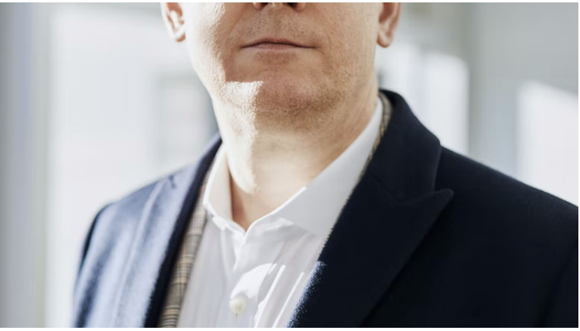
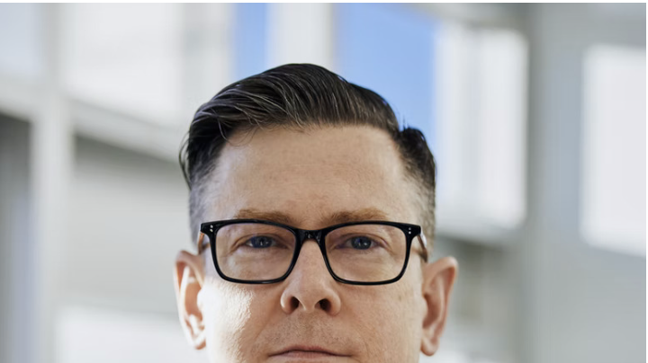
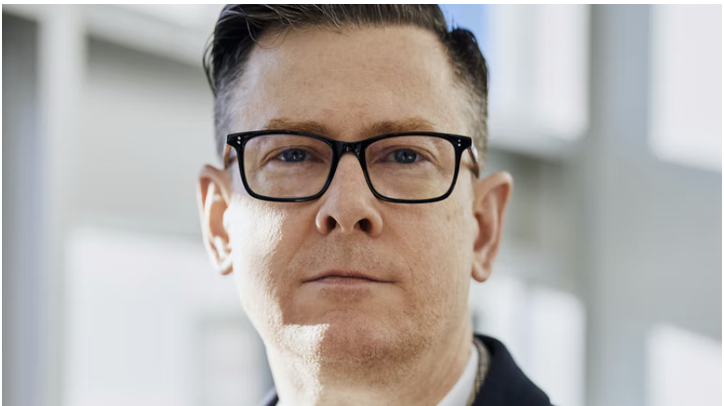
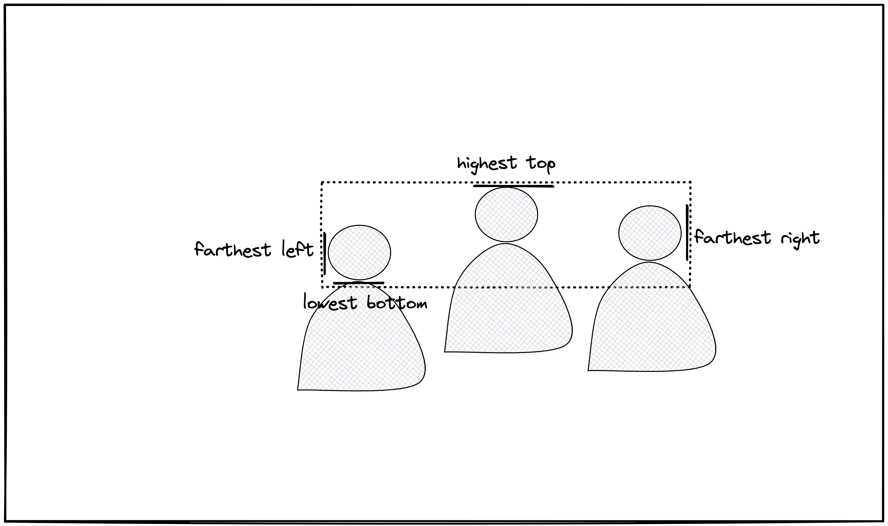
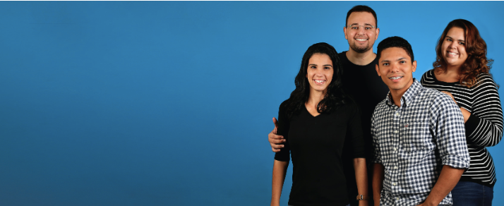
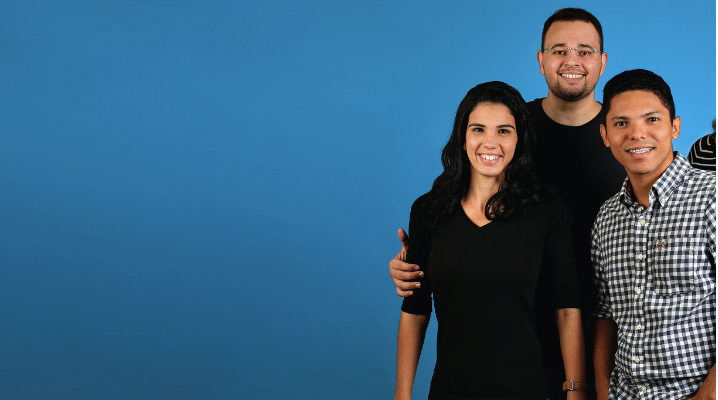
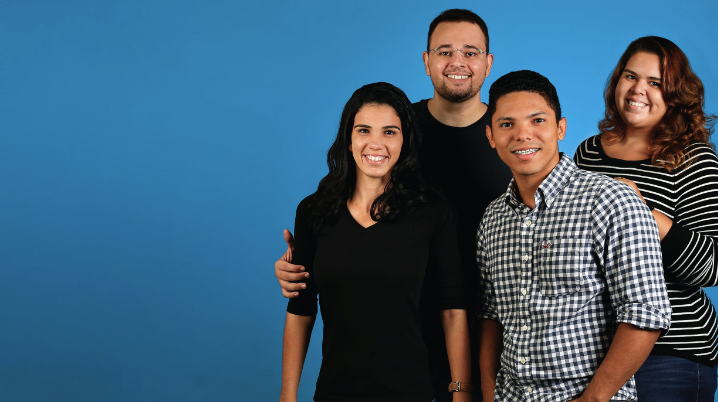

## The problem

Let’s imagine that we need want to display an image on our webpage in an aspect ratio of 16 by 9. Now, this would be easy if we have a source image that has the same aspect ratio. But as a developer, you don’t always have control over this. You’ve received the following image:


Luckily, with modern CSS, we can easily make this 16 by 9 with the following to CSS lines:

```css
img {
  aspect-ratio: 16 / 9;
  object-fit: cover;
}
```

Once doing this, we see the following result in the browser:



Oh no! We can’t see the face anymore. This is because by default the [object-position](https://developer.mozilla.org/en-US/docs/Web/CSS/object-position) is set to `center center` which will center the crop on both the x-axis and the y-axis. No problem, we can just update our CSS to:

```css
img {
  aspect-ratio: 16 / 9;
  object-fit: cover;
  object-postion: top center;
}
```

But wait, now the bottom of the face isn’t visible:



We can ultimately fix the `object-position` by passing pixel or percentage values to get the crop just right. This is however a painstaking process that you would have to do for all your images. Besides that, what if the images can be random and you can’t cover all edge-cases?

**We need a way to crop and position the crop just right for the face to be in view.**

## The Face Detection API to the rescue!

The Face Detection API, a spinoff of the [Barcode Detection API](https://developer.mozilla.org/en-US/docs/Web/API/Barcode_Detection_API), is at the time of writing only available on Chrome after turning on a feature flag. You can do this by going to `chrome://flags`, searching for `#enable-experimental-web-platform-features` and turning it on.


Your browser will restart and the Face Detection API will be available

So what can you do with this API? You can pass an image and it will return you the _bounding box_ of the detected face(s). It will also give you an array of _landmarks_. These _landmarks_ consist of detected eyes, noses and mouths per detected face. Today, we’re just focussing on the actual faces. If we run the API on the previous image, we get this result:

```json
[
  {
    "boundingBox": {
      "x": 230.64181518554688,
      "y": 208.36253356933594,
      "width": 292.52178955078125,
      "height": 292.52178955078125,
      "top": 208.36253356933594,
      "right": 523.1636047363281,
      "bottom": 500.8843231201172,
      "left": 230.64181518554688
    },
    "landmarks": [
      // removed from example
    ]
  }
]
```

So, we can now use this data to know where to position our crop, right? Well, that’s what I thought. There is a pitfall. These values are referring to the intrinsic size of the image you pass. In our demo, we scaled down our image. Therefore, these values need to also be scaled down.

### Mapping the intrinsically based values to the scaled-down based values

First, we need to know the width and the height of the intrinsic image. We can do this with the following part of the code:

```jsx
async #getIntrinsicImageNodeSize() {
    const that = this;

    return new Promise((resolve) => {
      var url = this.imageNode.src;
      var img = new Image();
      img.onload = function () {
        const { width, height } = img;

        that.intrinsicImageNodeSize = { width, height };
        resolve();
      };

      img.src = url;
    });
}
```

Once we have the intrinsic width and height, we can map our face detection bounding box:

```jsx
#getBoundingBoxForFace() {
    const imageNodeBoundingBox = this.imageNode.getBoundingClientRect();

    return {
      top:
        (faceDetectionBoundingBox.top / this.intrinsicImageNodeSize.height) *
        imageNodeBoundingBox.height,
      bottom:
        (faceDetectionBoundingBox.bottom / this.intrinsicImageNodeSize.height) *
        imageNodeBoundingBox.height,
      left:
        (faceDetectionBoundingBox.left / this.intrinsicImageNodeSize.width) *
        imageNodeBoundingBox.width,
      right:
        (faceDetectionBoundingBox.right / this.intrinsicImageNodeSize.width) *
        imageNodeBoundingBox.width,
      width:
        (faceDetectionBoundingBox.width / this.intrinsicImageNodeSize.width) *
        imageNodeBoundingBox.width,
      height:
        (faceDetectionBoundingBox.height / this.intrinsicImageNodeSize.height) *
        imageNodeBoundingBox.height,
    };
}
```

In essence, what we’re doing is taking the face detection bounding box that is based on the intrinsic size of the image and calculating what the pixel values would be for our scaled-down image. Cool, we now have the following values:

```json
{
  "top": 107.68089590146559,
  "bottom": 258.8549473488978,
  "left": 119.1947456238351,
  "right": 270.36880860493204,
  "width": 151.174062981097,
  "height": 151.1740514474322
}
```

We can now take these values to, for instance, draw a box on the detected face(s) for easier debugging:


If you want to learn more about this API, the Barcode Detection or Text Detection API, you can watch my Friday Tip on _[A first look at the Shape Detection API](https://www.youtube.com/watch?v=ZnSTi3Wbs7g)_. **While you're there, make sure to subscribe!**

## Using the face detected bounding box to set the crop position

Now that we have these values, we can set the `object-position` x and y value to be the top and left of the face detected bounding box. A downside to this, however, is that we need to recalculate these values everytime the image on the page resizes. A smarter way would be to set these value percentage based for both the debugging boxes and the actual `object-position` value. Let's set to percentages for the `object-position` property:

```jsx
#setObjectCrop() {
    const boundingBox = this.#getBoundingBoxForFace();
    const { width: imageNodeWidth, height: imageNodeHeight } =
      this.imageNode.getBoundingClientRect();

    const { top, right } =
      this.#mapFaceDetectionBoundingBoxFromIntrinsicSize(boundingBox);

    const { setObjectFit, setObjectPosition } = this.options;

    if (setObjectPosition) {
      this.imageNode.style.objectPosition = `${Math.floor(
        (right / imageNodeWidth) * 100
      )}% ${Math.floor((top / imageNodeHeight) * 100)}%`;
    }

    if (setObjectFit) {
      this.imageNode.style.objectFit = "cover";
      this.imageNode.style.aspectRatio = "16 / 9";
    }
}
```

We basically use the top and left values of the face detected bounding box and calculate what percentage those values are based on the height and width of the image respectively. We can now see the smartly cropped face in view:



Great, that seems to work! Whichever image I use, I can be assured that the face will be in view. But what about multiple faces?

## Creating a combined bounding box for multiple faces

Luckily, we can quite easily implement the functionality to get the combined bounding box for the detected faces:

```jsx
#getOuterBoundingBoxFromFaces() {
    const sortedFacesByTop = this.faces.sort(
      (a, b) => b.boundingBox.top - a.boundingBox.top
    );
    const sortedFacesByBottom = this.faces.sort(
      (a, b) => b.boundingBox.top - a.boundingBox.top
    );
    const sortedFacesByLeft = this.faces.sort(
      (a, b) => b.boundingBox.left - a.boundingBox.left
    );
    const sortedFacesByRight = this.faces.sort(
      (a, b) => b.boundingBox.right - a.boundingBox.right
    );

    const top = sortedFacesByTop.at(-1).boundingBox.top;
    const bottom = sortedFacesByBottom.at(0).boundingBox.bottom;
    const left = sortedFacesByLeft.at(-1).boundingBox.left;
    const right = sortedFacesByRight.at(0).boundingBox.right;

    return {
      top,
      bottom,
      left,
      right,
      width: right - left,
      height: bottom - top,
    };
}
```

Firstly, we get the highest top, lowest bottom, farthest left and farthest right of all the detected faces. We can then easily calculate what the width and height have to be for the combined bounding box.



Then, we use those values to set the value for the `object-position` just like we did earlier. A short demo for this image:



Cropping this normally would look like this:



So we detect all their faces:


And use the combined bounding box to smartly crop the image:



## Looking back

Naturally, we can optimize this demo even further with, for instance, margins for the crop and more. Next to that, this is in no way a production-ready solution due to it just working on Chrome behind a feature flag.

More important is that this shows just how powerful the browser can be. By combining two techniques, the Face Detection API and the `object` properties combined with the `aspect-ratio` property in CSS, we create an incredibly powerful tool. You can view the demo with the end result with examples [here](http://face-cropper-demo.davebitter.com/). You can view the code of this demo [here](https://github.com/DaveBitter/face-cropper-demo).
