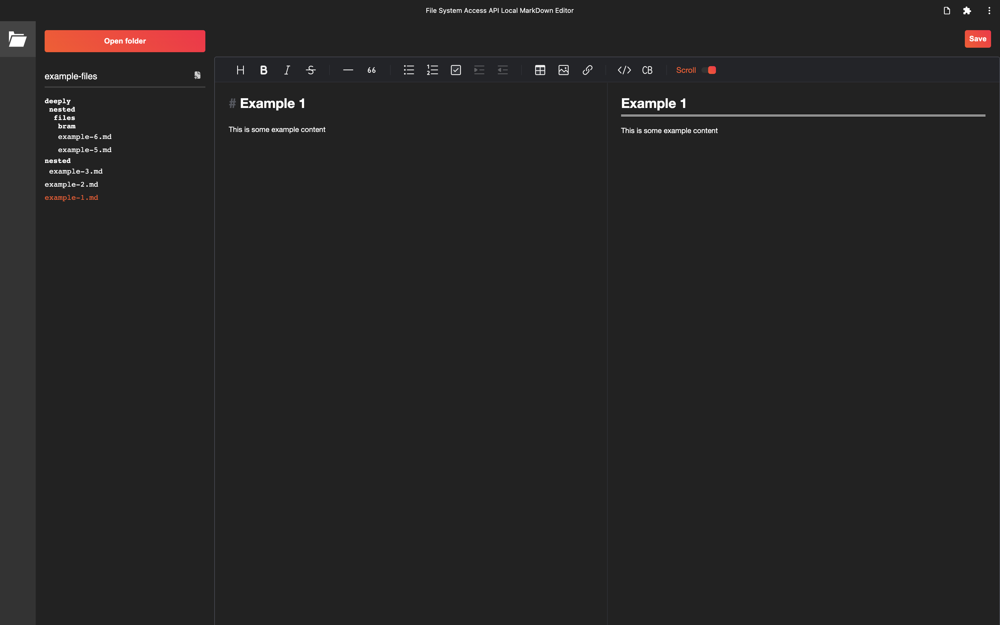
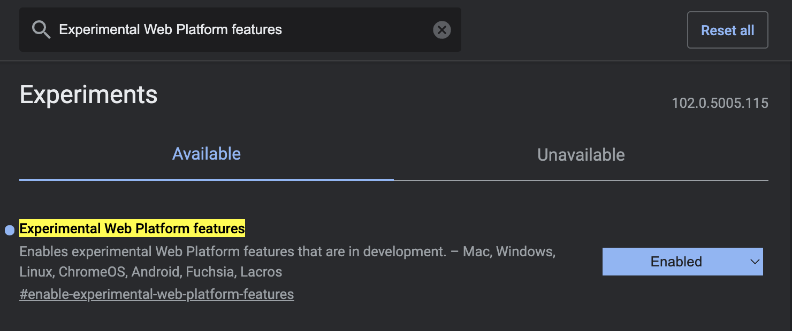
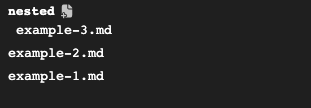
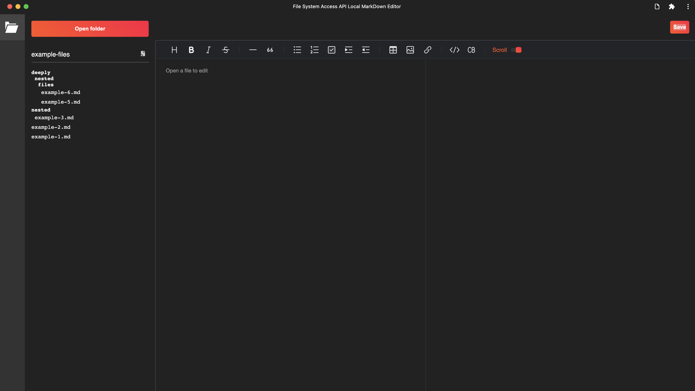

The web is an incredibly powerful platform that keeps getting better. I’m always on the hunt for new capabilities, like the File System Access API, to create the best user experience on the web. In this article, we’ll have a look at what the File System Access API is, how it works and why this is such a great addition to the web as a platform.

## Web capabilities (Project Fugu)

There is a tremendous stride being made to close the gap between native and the web. Our users expect more and more native-like functionalities for the web. To standardize and offer this, an effort is made to offer APIs for the web that developers can use to enrich their web applications under the name Project Fugu, ontherwise known as Web Capabilities.

Quite a few API’s that you might already know or use fall under this effort. There is a handy [Fugu API Tracker](https://fugu-tracker.web.app/) that shows you all of them and the status they’re in. You might have read [one of my articles on the FaceDetection API](https://techhub.iodigital.com/articles/native-face-detection-cropping) which is also part of Project Fugu. Today, we’re looking at the File System Access API which is a great addition to the web!

## What is the File System Access API for?

As you might have guessed, this API allows you to access local files on your user’s system. But not just access them, you can perform full [CRUD operations](https://www.freecodecamp.org/news/crud-operations-explained/) straight from the browser. On the one hand, this gave me quite a few exciting idea’s to use this for. On the other hand, it gave me some concerns about potential dangers as well.

To find the answers to how it works and if it’s safe, I decided to build a small demo application based on the File System Access API. I’m going to show you how you can build a local Markdown editor on the Web. This app will need to be able to **C**reate, **R**ead, **U**pdate and **D**elete local Markdown files on the user’s system.



If you’d like to try the demo you can [visit the web application](https://md-editor.davebitter.com/). Beware that this is for some features dependent on having the experimental features flag set in your Chrome settings. You can do this by going to `chrome://flags`, searching for `#enable-experimental-web-platform-features` and turning it on.



## How does the File System Access API work?

This article will show some simplified code examples with any logic outside of the File System Access API stripped. If you do want to view the entire source code for the demo web application, [head over to GitHub to view the repository](https://github.com/DaveBitter/file-system-api-markdown-editor). Let’s have a look at all four of the CRUD operations.

### Read

Firstly, I want to show a sidebar with files just like an IDE. This will look something like this:


Let’s see how you can read files and use the result to create a sidebar like this.

#### Reading a single file

To get a single file you can request access like this:

```jsx
const openFile = async () => {
  const [fileHandle] = await window.showOpenFilePicker({
    types: [
      {
        description: 'Markdown files',
        accept: {
          'text/md': ['.md'],
        },
      },
    ],
    multiple: false,
  });

  // Do something with the file handle
};

elements.openFileButton.addEventListener('click', openFile);
```

Quite a few things are happening here. Let’s go over each of them. First, I create an asynchronous function. This is needed because we need to await the file picker window in the next line. Next, I actually request to open the native file of the user with `window.showOpenFilePicker`. You can pass a couple of options here like which files you allow and whether the user can pick multiple. The browser opens a file picker just like how it would do if you show a regular file input:


The user also needs to confirm that they trust my web application and allow me to read the selected files. Note that they only have to do this the first time (per file or directory). The UI looks a bit like this:


As the result could be multiple file handles, the result of `window.showOpenFilePicker` is always an array. As I’m only requesting a single file, I can destructure that first file handle and name it `fileHandle`. Finally, I can use the file handle for my web application.

Like many other powerful APIs, calling the `window.showOpenFilePicker` should be done in a [secure context](https://w3c.github.io/webappsec-secure-contexts/). To do this, you should only call the `openFile` helper function through an event triggered by the user. In this example, that’s done after the user clicks on the button to open a file.

#### Reading an entire directory (recursively)

Now, I could allow the user to select multiple files and build the sidebar with those file handles. This is not how an IDE works, however. Usually, you select a directory and it will then create a sidebar showing all the files in that directory with all subdirectories shown as well. Let’s request access to an entire directory instead of just a file.

This works just like the first example, except you now call `window.showDirectoryPicker` instead of `window.showOpenFilePicker`:

```jsx
const openDirectory = async () => {
  const directoryHandle = await window.showDirectoryPicker({
    types: [
      {
        description: 'Markdown files',
        accept: {
          'text/md': ['.md'],
        },
      },
    ],
  });

  // Do something with the directory handle
};

elements.openDirectoryButton.addEventListener('click', openDirectory);
```

The second difference is that I get a single directory handle back as a result of `window.showDirectoryPicker`. To get all the file handles in that directory, I can do this:

```jsx
const fileHandles = directoryHandle.values();
```

I now have an array of all the file handles. Well, the file handles and potentially any directory handles. As there could be subdirectories, there could potentially be directory handles in the array.

Unfortunately for me, these directory handles don’t contain an array of file handles in that directory. I can, however, do something similar to the `window.showDirectoryPicker` with a directory handle. I can request the file handles in the directory as follows:

```jsx
const [subDirectoryHandle] = fileHandles;

const subDirectoryHandles = subDirectoryHandle.values();
```

Now, if this array of handles contains a directory, I can do it again. This sounds like I need to do some recursive programming to walk through the file tree. I wrote a recursive that would, simplified, look something like this:

```jsx
const getEntriesRecursivelyFromHandles = async (handles) => {
  const entries = [];

  for await (const handle of handles) {
    const { kind } = handle;

    switch (kind) {
      case 'file':
        entries.push({
          kind,
          handle,
        });
        break;

      case 'directory':
        const directoryHandles = await entry.values();

        entries.push({
          kind,
          handle,
          entries: await getEntriesRecursivelyFromHandles(directoryHandles).catch(console.error),
        });
        break;
    }
  }

  return entries;
};
```

It might look a bit complex at first, but let’s go over some of the parts. I first create an array that will hold all entries I need to build the sidebar. Then I loop over all the passed handles. If the `kind` of the handle is a file, I can just push a new object to the entries array for that file. If the handle is a directory, I request all the handles for that subdirectory and push an object to the entries array with one additional field. I add an entries key which calls the recursive function with the directory handles for the subdirectory.

I now have an array of objects with files and directories. If an item is a directory, it will have a key called `entries` which is again an array of files and directories. Great, now let’s use the actual handles.

#### Using the file handles

Now that I have this array of handles that is easier to work with, I can start building the sidebar. For the sake of brevity and focus on just the File System Access API, I won’t show the code for this, but please refer to [the project on GitHub](https://github.com/DaveBitter/file-system-api-markdown-editor). Once I have a sidebar with all the file handles, I want to display the Markdown files in a Markdown editor. There are many libraries on NPM that offer a Markdown editor. For this vanilla JS demo, I used [ToastUI Editor](https://ui.toast.com/tui-editor). Once added to the page, it’s time to load the content of the Markdown files into the editor. I can do this, simplified as followed:

```jsx
sidebarItemFileButton.addEventListener('click', async () => {
  const file = await fileHandle.getFile();
  const contents = await file.text();

  editor.setMarkdown(contents);
});
```

Now, once the user clicks on a sidebar item, the corresponding file handle will be used to get the text content and added to the editor.

### Update

Great, you can see all the files, open them in the editor and make changes. Naturally, you want to save these changes to the filesystem. Let’s see how I can use the file handle to update the content:

```jsx
saveButton.addEventListener('click', async () => {
  const contents = editor.getMarkdown();

  const writable = await fileHandle.createWritable();
  await writable.write(contents);
  await writable.close();
});
```

First, I add an event listener to the save button. Next, I get the latest content from the Markdown editor. I can then create a writable for the file handle that I’m making changes to, write the updated content and close the writable. While doing this the first time, the user will see another confirmation window to allow the web application to save changes:


Now, when the user checks the local file, they will see that the changes are saved.

### Create

The user might also want to create a new file in the root or one of the subdirectories. Just like an IDE, I’ve added a button to do so:



I then added an event listener that calls a function that will open a new window in the correct directory to create a new file in:

```jsx
sidebarDirectoryNewFileButton.addEventListener('click', async () => {
  await window.showSaveFilePicker({
    startIn: directoryHandle,
    suggestedName: 'untitled.md',
    types: [
      {
        description: 'Markdown files',
        accept: {
          'text/md': ['.md'],
        },
      },
    ],
  });
});
```

I use `window.showSaveFilePicker` to trigger the UI for the user to save a new file. I can pass it a configuration to help the user a bit. In this example, I tell it to start in the subdirectory where the user clicked on the button for a new file. Next, I gave it a sensible suggested name. Finally, I told it that a Markdown file will be saved. The user will see the following:


### Delete

Finally, I’ve added a button to remove a file or directory. The simplified code example for this is fairly similar and looks like this:

```jsx
sidebarDirectoryRemoveButton.addEventListener('click', async () => {
  await directoryHandle.remove();
});

sidebarFileRemoveButton.addEventListener('click', async () => {
  await fileHandle.remove();
});
```

Although this works for the file handle, there is something to note for the directory handle. While you can remove an empty directory this way, it fails when there are files or subdirectories in that directory. A workaround could be to first remove all the files and subdirectories recursively as you have all the handles for them. Then, you can remove the empty directory.

And that was the final of the CRUD operations I wanted to offer the user in this demo web application. Naturally, quite a bit of code was added for the UI part, but with these four concepts, you can build an entire web application that uses the local filesystem.

## Why is this a great addition to the web as a platform?

So, now you know how it works. Let’s have a look at why it is important to start using this API.

### Improve user experience

Working with your own local files in a web application has always been a bit cumbersome. You’d have to open a file from your system, make changes through the web application and finally save the file. The saving of the file was the more cumbersome part. You need to overwrite your local file every time and confirm the overwriting in a system popup.

Native (desktop) apps handle this way better. The native app can save/overwrite a file directly to your local storage. The File System Access API closes this gap between web and native perfectly under project Fugu.

### Create performant web applications

A solution to working with files on the web has therefore usually been to upload a file and have a copy saved in the cloud. Especially with larger files, CRUD operations are slower than directly performing them on the local file. Now, for the demo project you saw earlier this won’t be an issue, but imagine having hundreds of video files. This can be gigabytes of data to load upfront. With the File System Access API this is not an issue as you just need the handles for all those large files and can then load them when needed.

### Own your content

One of the principles I stand for is to own your content. This goes for any articles I write, but can be applied to any form of content. I don’t want to be locked out by a system and lose content that I own. Let’s say that you’re using a major blogging platform. What happens if they decide to suspend your account (perhaps while this is not fair)? Having the files locally on my system at all times is a great way to combat this and still be able to have your content safe.

An upside of using a platform where your files are in the cloud is that you always have a backup. With smart directories on your machine, this won’t be an issue anymore. For instance, you can have the files locally on a Google Drive synced directory. You will then always have the best of both worlds.

## Some inspiration

Naturally, the File System Access API is great for web apps that modify text like the demo shown in this article. Another great example is a web application like [edit.photo](http://edit.photo) by [Rik Schennink](https://twitter.com/rikschennink). Imagine having local file access to all your photos and saving changes directly. Finally, I think this could be data processing web applications. Especially combining PWA installability (for desktop) with it. Being able to write your own web applications to help you with your daily tasks is really cool!



## What would make the File System Access API even better?

Naturally, there are always a few things that could be better. At least, in my opinion. I ran into a couple of things while building the demo application. This is the main reason I can recommend trying to build something when learning a new technique. It forces you into real-world problems and find out why they happen and how to fix them.

### Get all files in subdirectories in one go

In the demo application, I want to display all nested files as well. To do this, I had to add a recursive function that would give me them. Luckily, the File System Access API gave me the right tools to do it, but in my opinion, it would be nice if this logic could be included in the API itself. There might be some reasoning behind it which I’m currently unaware of, however. This goes for all these points I’m about to mention.

### Only return accepted file formats in a directory

In my demo application, I am only interested in getting any (nested) Markdown files in the directory I open. It does however return all files, regardless of their file type. Naturally, I could filter those in my recursive function, but this is not ideal for me. I think performance wise this could also be beneficial to add.

### Be able to remove a directory with all its contents

It took me quite a while to understand why the logic to remove a directory didn’t work. The error message didn’t give me much insight as well. As the reference article I used clearly stated that it was possible, I kept at it. It turned out that it does work when the directory is empty. My first thought was that this might have been done to protect the user from accidentally removing an entire directory. Be it due to a malicious web application or a simple mistake. On the other hand, I could just recursively go through all the (nested) handles and remove them. That would trigger the user to give permission every time and therefore provide feedback, though.

## Next steps

The File System Access API is in active development and support for more browsers is needed to use this in production. I’ll keep an eye out for this API and will definitely use it for surprising use cases I will run into.

If you like to read a bit more about the specifics of the File System Access API, I can recommend [this article](https://developer.chrome.com/articles/file-system-access/) by [Pete LePage](https://twitter.com/petele) and [Thomas Steiner](https://twitter.com/tomayac).

Finally, try to use the File System Access API yourself. I bet there are quite a few tasks that you need to do often where files are involved. Making this a bit easier through a web application (or PWA) could be quite cool to work on.

For now, thanks for reading!
