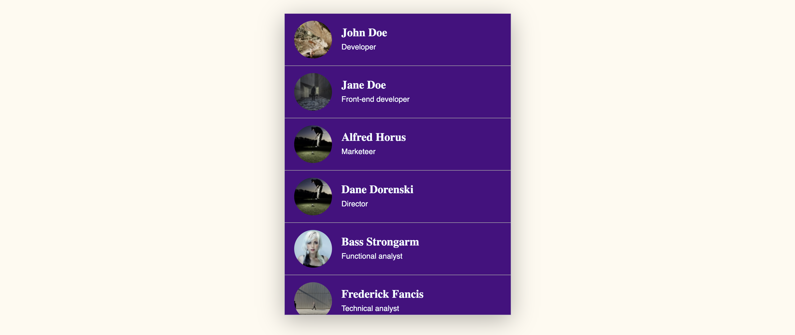
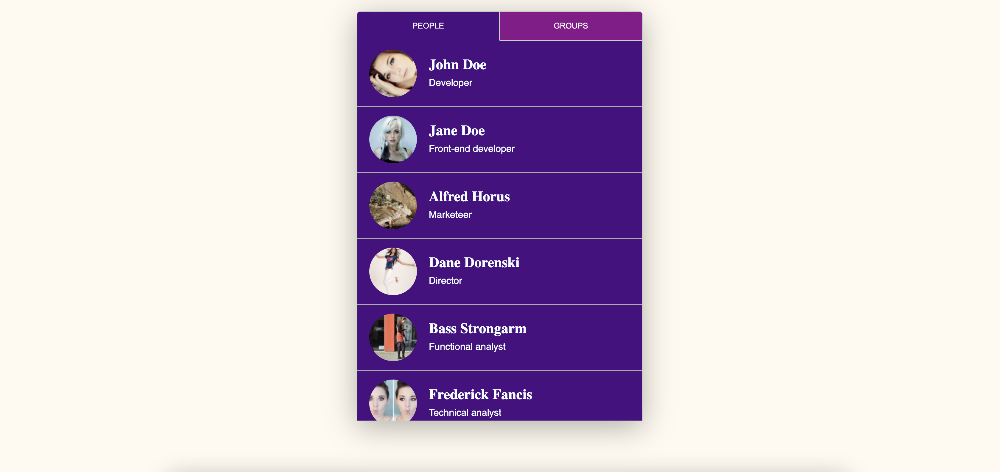

Scroll snapping is hip and while we all have styled numerous sorts of tab panes and scroll boxes, I had an idea of combining them. What started out as a simple “scroll snapping experiment” turned out to be an accessibility study.

## The basic scroll snapping idea with CSS.

It started out as a simple test. By having a container with 2 lists. The lists would be next to each other and by scrolling left and right, you could toggle between them.

The **HTML setup** was very simple:

```html
<section class="scroll-snap-panel">
  <div class="scroll-container container">
    <ul class="scroll-list people">
      <!-- some list items here -->
    </ul>
    <ul class="scroll-list groups">
      <!-- some list items here -->
    </ul>
  </div>
</section>
```

The `.scroll-container` would become a grid with 2 items that have the full width of their container. The scroll container would have an `overflow-x` and some smooth scroll snapping options.

Here is the basic **CSS** for this:

```css
:root {
  --container-width: 480px;
}

.container {
  display: grid;
}

.scroll-snap-panel {
  width: 100%;
  margin: 30px auto;
  box-shadow: rgba(0, 0, 0, 0.3) 0px 10px 50px;
  max-width: var(--container-width);
}

/* the scroll magic */

.scroll-container {
  position: relative;
  grid-template-columns: repeat(2, var(--container-width));
  -webkit-overflow-scrolling: touch;
  overflow-x: scroll;
  scroll-snap-type: x mandatory;
  scroll-behavior: smooth;
  max-height: 85vh;
  border: 1px solid #ccc;
  border-top: 0;
}

.scroll-list {
  display: block;
  width: 100%;
  height: 80vh;
  margin: 0;
  padding: 0;
  list-style: none;
  scroll-snap-align: start;
  scroll-snap-type: y proximity;
  overflow-y: scroll;
}

.scroll-list li {
  display: grid;
  grid-template-columns: 80px 1fr;
  gap: 20px;
  align-items: center;
  padding: 15px 20px;
  border-bottom: 1px solid #aaa;
  scroll-snap-align: start;
}
```



([codepen for the first step here](https://codepen.io/utilitybend/pen/JjMrjea))

## A fun little component, but not accessible at all.

There are a two main problems with this little component:

- It can only be navigated by using a mouse / trackpad
- There is no indication that it can be scrolled horizontally if you don’t have your scrollbars visible at all times.

In short, not accessible at all and it got me thinking. What if I made a hybrid component where you can use this awesome scroll snapping functionality in combination with tabs. This would:

- Create a fun mobile experience
- Still have the functionality of tabs
- Would fix some accessibility issues along the way

### First things first, fixing the UX.

([Visual representation of this step](https://codepen.io/utilitybend/full/gOoGbMr))

The first thing on the agenda was making an indication of the hidden content simply by adding some tabs to our HTML:

```html
<section class="scroll-snap-panel">
  <div class="tabs-container container">
    <button data-target="people-tab" class="people tab active">People</button>
    <button data-target="groups-tab" class="groups tab">Groups</button>
  </div>
  <div class="scroll-container container">
    <ul class="scroll-list people" id="people-tab">
      <!-- List items here -->
    </ul>
    <ul class="scroll-list groups" id="groups-tab">
      <!-- List items here -->
    </ul>
  </div>
</section>
```

The next thing I did was adding a bit of CSS for the active tabs and adding some JS, which will use the tabs to scroll to the right position. You can view the CSS in the demo, but the basic idea of the JS was the following:

```js
const tabs = document.querySelectorAll('.tab')
const scrollContainer = document.querySelector('.scroll-container')
const scrollLists = document.querySelectorAll('.scroll-list')

/* check for clicks and update scroll position based on target offset */
tabs.forEach((tab) => {
  tab.addEventListener('click', () => {
    const target = document.getElementById(tab.dataset.target).offsetLeft
    scrollContainer.scrollLeft = target
  })
})

/* 
when the scrollcontainer is scrolled horizontally, 
check the current scrollposition is the same as the left offset, 
and set the tab active when that's the case 
*/
scrollContainer.addEventListener('scroll', () => {
  let scrollPos = scrollContainer.scrollLeft

  scrollLists.forEach((list) => {
    let listId = list.id
    let listButton = document.querySelector(`.tab[data-target="${listId}"]`)
    if (scrollPos === list.offsetLeft) {
      ;[...listButton.parentElement.children].forEach((sib) => {
        sib.classList.remove('active')
      })
      listButton.classList.add('active')
    }
  })
})
```

And for a moment, I thought it was perfect:

- It has an indication of multiple panes
- You can use tab and shift-tab to switch between tabs and enter to activate them.

But I still wasn’t happy. There was no indication of tabs when using voice over, The list is not vertically scrollable with a keyboard. So when it came to accessibility. I still had ways to go.

## The final improvement to make it accessible.

([Visual representation of this step](https://codepen.io/utilitybend/pen/poWWaRv))

I knew I had some reading to do. So I started looking at [the documentation of tabs at the aria working group website](https://www.w3.org/TR/wai-aria-practices/#tabpanel). A quick summary of how tabs should behave:

**Using TAB**

- The first TAB should enter the tab component on the first (active) button.
- The second TAB should change the focus inside the active tabpanel.
- The third TAB should leave the tabbed component

**Arrow keys**

- While focussing on the tab button, the arrows should switch between them.
- The tabpanels can either be activated automatically while using the arrow or manually by pressing the enter key (for this example, I chose automatically)

**Special case**

Because I'm working with scroll behaviour, I wanted the arrow keys to work inside the tabpanel itself. By pressing the left or right arrow key while scrolling through the list, I want it to switch the active panel and focus on the new active tab as an indication of what happened.

They have [some great examples](https://www.w3.org/TR/wai-aria-practices/examples/tabs/tabs-1/tabs.html) at the ARIA working group, so based on their example of automated tabs, I started by changing my HTML to the following:

```html
<section class="scroll-snap-panel" role="tablist" aria-label="users and groups">
  <div class="tabs-container container">
    <button
      data-target="people-tab"
      role="tab"
      aria-selected="true"
      class="people tab active"
      aria-controls="people-tab"
    >
      People
    </button>
    <button
      data-target="groups-tab"
      role="tab"
      aria-selected="false"
      class="groups tab"
      aria-controls="groups-tab"
      tabindex="-1"
    >
      Groups
    </button>
  </div>
  <div class="scroll-container container">
    <div
      class="scroll-list people"
      role="tabpanel"
      tabindex="0"
      id="people-tab"
      aria-label="people"
    >
      <ul>
        <!-- list items here -->
      </ul>
    </div>
    <div
      class="scroll-list groups"
      role="tabpanel"
      tabindex="-1"
      id="groups-tab"
      aria-label="groups"
      hidden="hidden"
    >
      <ul>
        <!-- list items here -->
      </ul>
    </div>
  </div>
</section>
```

Something to note here. You might notice that I wrapped my lists inside another `<div>`. This is because a `role=”tabpanel”` should not be used on an unordered list.

By adding [a bit of JS from the ARIA working group](https://www.w3.org/TR/wai-aria-practices/examples/tabs/tabs-1/tabs.html) and infusing it with my own code. I was able to create something interesting and accessible. I learned a lot from this experience and the goal of this post was to take you on a little thought journey. Accessibility is very important, and we might not get it perfect all the time, but a bit of effort can go a long way.

[The final example](https://codepen.io/utilitybend/pen/poWWaRv), with kudos to people who create examples in the ARIA working group.


