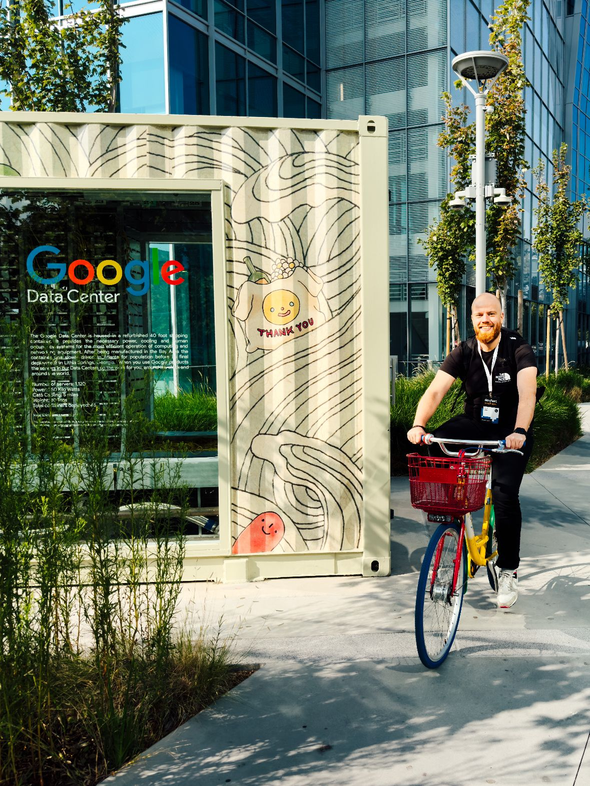
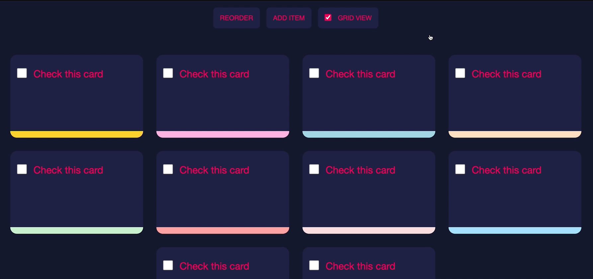
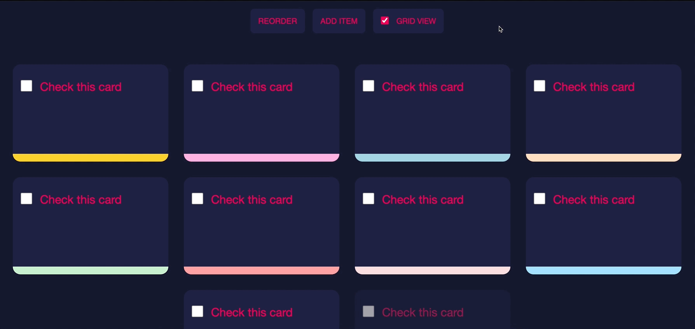
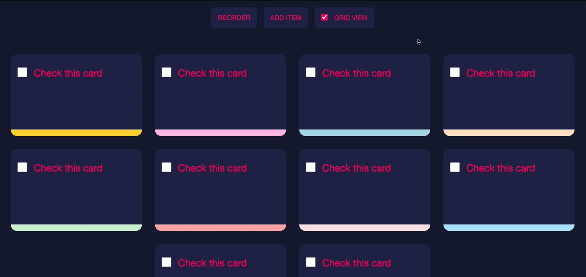
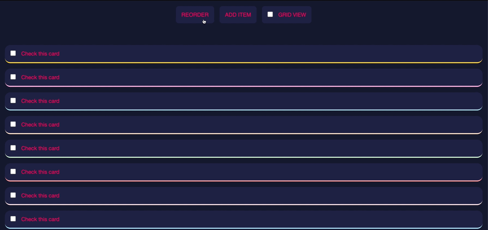
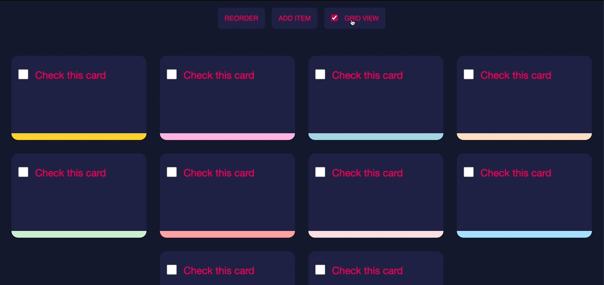

You might have heard about the View Transitions API in the context of animating between web pages. Whilst this is certainly awesome, you can apply this approach on a way smaller level to create awesome animated interactions in your web applications!

A few weeks ago I was lucky enough to visit the Google Campus in San Francisco through the Google Developer Expert program I am part of.



There, [Una Kravets](https://twitter.com/Una) showed [a demo](https://codepen.io/una/pen/eYbOOQp) she built using the [View Transitions API](https://developer.mozilla.org/en-US/docs/Web/API/View_Transitions_API) to animate the deletion of cards. This excited me to look at using the API for not just page transitions, but more for micro animations!

## Give feedback to the user

As always, I made to see what we can do with this approach:

<div className="md:-mx-32 my-4">
  <div className="relative aspect-w-16 aspect-h-9 border">
    <iframe src="https://codepen.io/davebitter/full/JjwgdRZ" className="absolute inset-0" style={{
      width: "166.66%",
      height: "166.66%",
      transform: "translate(-20%,-20%) scale(.6)",
    }}></iframe>
  </div>
</div>

[View on CodePen](https://codepen.io/davebitter/full/JjwgdRZ)

First, I created a layout like I would normally do. Next, I wrote some JavaScript to remove a list item with a small delay to see it get the checked state first. Removing an item looked like this:

```jsx
list.addEventListener("change", (e) => {
  setTimeout(() => {
    removeListItemFromInputChangeEvent(e);
  }, 300);
});
```



The user experience of removing an item is not great. Because the item is removed, the item next to it now takes it place. Suddenly, this item is in the place of the removed one which makes it look like it was always there. What if we can remove it, have all the items neatly animate to their new position and by doing that give the user the proper feedback they need? In the past, this took quite a bit of JavaScript to do and even then it worked a bit janky. Now let’s (technically) add two lines of code. First, wrap the call of the remove function in a `startViewTransition`. For good measure, we’ll also feature check to progressively enhance the user experience. Meaning, if the View Transitions API is supported, we enhance the default behaviour with a nice animation:

```jsx {6,8}
list.addEventListener("change", (e) => {
  setTimeout(() => {
    if (!document.startViewTransition) {
      removeListItemFromInputChangeEvent(e);
    } else {
      document.startViewTransition(() => {
        removeListItemFromInputChangeEvent(e);
      });
    }
  }, 300);
});
```

Next, we add unique name to each of the list items:

```jsx {1}
<li style="view-transitions-name: card-1">
  <label>
    <input type="checkbox" />
    Check this card
  </label>
</li>
```

Now if we delete an item, we see this behaviour:



With just adding the `document.startViewTransition` and a unique `view-transitions-name` for each list item, the entire grid repositioning is animated providing better feedback to the user. Awesome, right? One of the biggest benefits I find of this approach is that the View Transitions API just takes a before and after state. It doesn’t matter how you build your layout, what properties change or how different the two views are. As long as before and after your change (the removal of the one list item node) items have matching `view-transitions-name` properties, the browser will animate between them.

Now, let’s add a button that allows you to add a new item:

```jsx
addButton.addEventListener("click", () => {
  addListItem();
});
```



We see the same unanimated behaviour as previously when deleting an item. Now let’s add the `document.startViewTransition` again:

```jsx
addButton.addEventListener("click", () => {
  if (!document.startViewTransition) {
    addListItem();
  } else {
    document.startViewTransition(() => {
      addListItem();
    });
  }
});
```


As you can see, now when an item is added, the rest of the items animate to their new position. We can even add a bit of JavaScript that will randomly reorder the list and see what this technique will do:


## Some other use cases

While having a grid of cards that may be filtered is a pretty common use case, you can naturally take this approach to other interactions as well. More than likely, you are working/have worked with tables. When adding to, removing from, sorting or filtering these tables the rows may change position. When calling the `startViewTransition` you can animate the changing of the rows like so:



You may have noticed I added a toggle to this demo for showing the items in a grid or underneath each other. When switching, that looks like this:



I though to myself, why not use this technique when switching between the two views?


## Start using this now

It has never been easier to animate between different views on the page. Whilst animating between pages might be a bit much to start with, try implementing the View Transitions API on a smaller part of a page to make smoother experiences in your web application whilst simultaneously providing feedback for a user’s interactions through animation. It only takes a line or two!

<div className="md:-mx-32 my-4">
  <div className="relative aspect-w-16 aspect-h-9 border">
    <iframe src="https://codepen.io/davebitter/full/JjwgdRZ" className="absolute inset-0" style={{
      width: "166.66%",
      height: "166.66%",
      transform: "translate(-20%,-20%) scale(.6)",
    }}></iframe>
  </div>
</div>

[View on CodePen](https://codepen.io/davebitter/full/JjwgdRZ)
